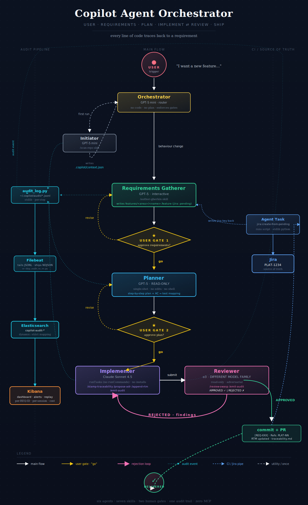

# `.github-private` — Org-wide Copilot Orchestrator

This repository contains the **shared agents, skills, scripts, and schemas** that every application's repos consume through GitHub Copilot. It is owned by the **Platform / Developer Experience team**, not by individual application teams.

## Why this repo exists

GitHub Copilot has two scopes for custom agents:

| Scope | Location | Visible from |
|---|---|---|
| Repository-level | `<repo>/.github/agents/*.agent.md` | That one repo only |
| **Organization-level** | `<org>/.github-private/agents/*.agent.md` | **Every repo in the org** |

The orchestrator described in `docs/workflow.svg` spans multiple repos (a Planner's plan can touch backend, frontend, and shared libraries). Putting agents in any one repo's `.github/agents/` makes them invisible to the others. So they live here. Agents and skills published from this repo appear in Copilot for every repo in the organization automatically — no per-repo install step.

## Layout

```
.github-private/
├── agents/                              # ← discovered org-wide
│   ├── initiator.agent.md
│   ├── orchestrator.agent.md
│   ├── requirements-gatherer.agent.md
│   ├── planner.agent.md
│   ├── implementer.agent.md
│   └── reviewer.agent.md
├── skills/                              # ← discovered org-wide
│   ├── discover-application/
│   ├── scan-repo/
│   ├── author-gherkin/
│   ├── stamp-traceability/
│   ├── propose-adr/
│   ├── append-rtm/
│   ├── review-owasp/
│   └── emit-audit/
├── schemas/handoffs.schema.json         # inter-agent payload contracts
├── instructions/                        # auto-applied to every Copilot interaction
│   ├── security.instructions.md
│   └── token-budget.instructions.md
├── copilot-instructions.md              # root project-wide rules
├── scripts/                             # invoked by skills via runTasks (see "Wiring" below)
│   ├── audit_log.py
│   ├── ship_audit_to_es.py
│   ├── enrich_audit_with_tokens.py
│   └── create_jira_from_feature.py
├── infra/                               # ops-team-owned config
│   ├── elastic-index-template.json
│   ├── filebeat.yml
│   └── kibana-setup.md
├── docs/                                # diagrams + architecture
│   ├── workflow.svg
│   ├── workflow.md
│   └── traceability-architecture.md
└── .github/workflows/
    └── create-jira-from-feature.yml     # runs on PRs *in this repo*; see CODEOWNERS
```

## What lives here vs in the app repos

| Concern | Where it lives | Why |
|---|---|---|
| Agent definitions | **Here** (`agents/`) | Same persona across all apps. One orchestrator, one reviewer. |
| Skills | **Here** (`skills/`) | Same conventions across all apps (BDD format, OWASP checklist, RTM rules). |
| Scripts | **Here** (`scripts/`, `skills/*/scripts/`) | Deterministic, versioned with the agents that call them. |
| Schemas | **Here** (`schemas/`) | The contract between agents must not vary by app. |
| `.copilot/catalog.json` | **Each app repo** | Catalog config can vary (some apps use Backstage, some ServiceNow). |
| `.copilot/application.json` | **Each app repo** (generated, gitignored) | Per-session per-application output of `discover-application`. |
| `.copilot/context.json` | **Each app repo** (generated, gitignored) | Per-session per-application output of `scan-repo`. |
| `.vscode/tasks.json` task wiring | **Each app repo** | Tasks need to invoke scripts at paths the local repo can reach. See per-app-repo-overlay. |
| `features/`, `docs/requirements.md`, `docs/traceability.md` | **Each app repo (primary one)** | Source of truth lives with the application code. |
| `docs/adr/` | **Each app repo** | Decisions are app-specific. |

The per-app-repo-overlay bundle gives you exactly what each application repo needs.

## How agents reach the scripts

Skills call scripts via the `runTasks` tool, which executes a VS Code task defined in `.vscode/tasks.json`. The task command needs to find the script. Three options, pick one per organization:

### Option A — Submodule (simplest, recommended for small orgs)

Each app repo adds this repo as a submodule under `.copilot/orchestrator/`. Tasks invoke `python .copilot/orchestrator/scripts/audit_log.py ...`. Update with `git submodule update --remote`.

### Option B — Per-machine clone (preferred at scale)

Each developer clones this repo to `$ORCH_HOME` (e.g. `~/.copilot/orchestrator`). Tasks invoke `python $ORCH_HOME/scripts/audit_log.py ...`. `$ORCH_HOME` is in `.envrc` or a shell profile. Updates via `git pull` (or scheduled). No per-app-repo footprint.

### Option C — Packaged tool (long term)

Publish the scripts as a versioned internal package (PyPI internal index or a binary release). Tasks invoke `copilot-orch audit-log ...`. Cleanest, but needs a release process.

Both the **org bundle** here and the **per-app-repo overlay** support all three. The overlay has tasks.json variants for each.

## Ownership and access

- **Repo type**: `.github-private` is a public-readable repo if your org is public, **org-readable only if you make it `Internal` or `Private`**. Make it **Private** unless you have a reason not to.
- **Maintainers**: Platform / DevX team. Add a `CODEOWNERS` file (see `governance/CODEOWNERS.example`) so changes to `agents/` and `instructions/` need platform review.
- **Branch protection**: require PR review, require CI green, no force pushes on `main`. Same as any production repo.
- **Versioning**: tag releases (`v1.0.0`, `v1.1.0`). Skill descriptions and inter-agent JSON Schemas are the API surface; breaking changes need a major version bump.

## CODEOWNERS — what to gate

```
/agents/                @your-org/copilot-platform-team
/skills/                @your-org/copilot-platform-team
/schemas/               @your-org/copilot-platform-team
/copilot-instructions.md @your-org/copilot-platform-team
/instructions/          @your-org/copilot-platform-team @your-org/security-team
/scripts/               @your-org/copilot-platform-team
/infra/                 @your-org/ops-team
/docs/                  @your-org/copilot-platform-team
```

`instructions/` has dual ownership: platform owns the format, security owns the rules.

## Updating agents — the change process

The same ceremony the agents enforce on app code applies to changes here:

1. **Open a `.feature` file in `features/`** describing the change to the orchestrator (yes, even meta-changes). REQ-ID like `REQ-ORCH-NNN`.
2. **Open a PR**. The Jira-creation workflow attaches a Jira key.
3. **Eat your own dog food**: a draft Implementer/Reviewer run on a sample app demonstrating the change behaves as expected. Attach the audit JSONL to the PR.
4. **CODEOWNERS approval** from `copilot-platform-team`.
5. **Bump the version tag** on merge. App repos that pin a specific tag can opt in to upgrades; ones tracking `main` get changes immediately.

The platform team is therefore the **first user of every change** — if it breaks the meta-flow, it doesn't ship.

## Versioning strategy for app repos

Two consumption modes, advertise both:

| Mode | App repo pins | Use when |
|---|---|---|
| **Latest** | Submodule on `main` / no version constraint | Internal apps; the platform team and app teams talk frequently |
| **Pinned** | Submodule at tag `v1.4.0` / package at `==1.4.0` | Regulated apps; auditors want stable behaviour between assessments |

Both work with all three wiring options above.

## How to update the org-wide agents without breaking apps

This is the question every shared-config maintainer faces. Three rules:

1. **Additive changes are free.** Adding a new skill, a new agent, a new optional field in a schema — never breaks consumers.
2. **Subtractive / behaviour changes require a major version bump and a migration note.** Removing a skill, renaming a field, changing the default value of a guardrail.
3. **Run the canary suite first.** Maintain 3–5 example app repos in `governance/canary-apps/` that exercise the main flows. CI runs the change against every canary before merge.

The `governance/` bundle has templates for the canary tests + a migration-notes template.

## Operational SLAs (suggested)

| Event | Response |
|---|---|
| Critical security finding (`SEC-A0X` blocking) anywhere in agents/skills | Hotfix tagged + announced same day |
| Skill description match accuracy degrades | Investigation within 1 sprint |
| Agent-frontmatter syntax breaks after a Copilot release | Pin to known-good Copilot version; fix within 1 week |
| App-team-requested new skill | Triage in next sprint planning |

## Diagram



Mermaid version: [`docs/workflow.md`](docs/workflow.md).
