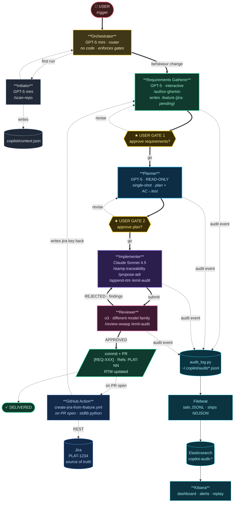

# Workflow — Mermaid version

For rendering inline in GitHub/markdown viewers. The SVG (`docs/workflow.svg`) is the polished version; this is the maintainable one.

## How to read this

- **Solid arrows** (`==>`): main flow. The user's request flows down, code flows back up after review.
- **Dotted arrows** (`-.->`): asides — first-run discovery, CI automation, audit events, revise loops.
- **Diamonds** (`{{...}}`): human approval gates. Two of them: after requirements, after plan. The user is the only one who can say "go".
- **Cylinders** (`[(..)]`): persistent state — context cache, Jira ticket, JSONL audit log, Elasticsearch.
- **The loop** that matters most: `Implementer ⇄ Reviewer`. It runs as many times as the Reviewer needs to say `APPROVED`. The user does *not* sit in this loop — they set direction at the two gates above it and let the agents iterate.

## Variations

- **Hot fix path**: Orchestrator routes a < 20-LOC defect against an existing REQ-ID directly to the Implementer (skipping RG + Planner). The Reviewer still runs.
- **Stale context**: when `.copilot/context.json` is > 24h old, the Orchestrator re-runs the Initiator before anything else.
- **Audit-only run**: any agent can be invoked individually for inspection; their audit events still ship, so the JSONL pipeline never has gaps.
